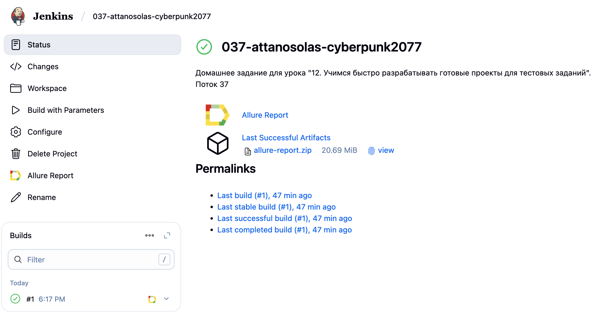
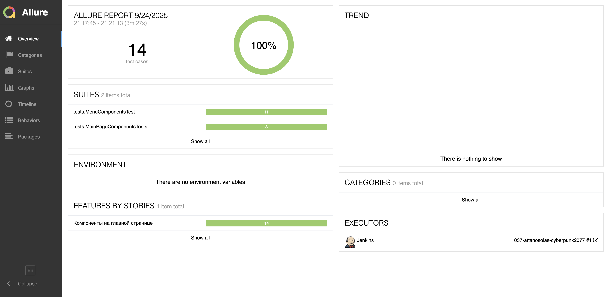
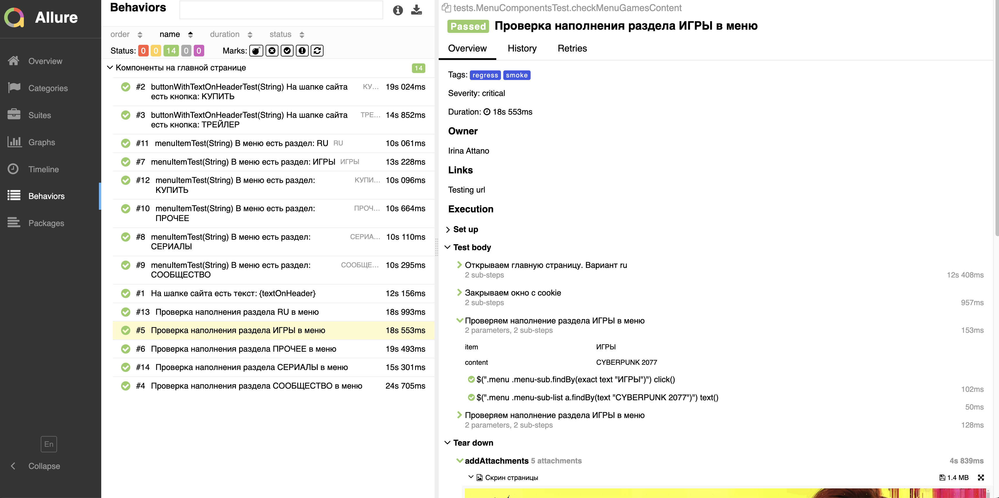
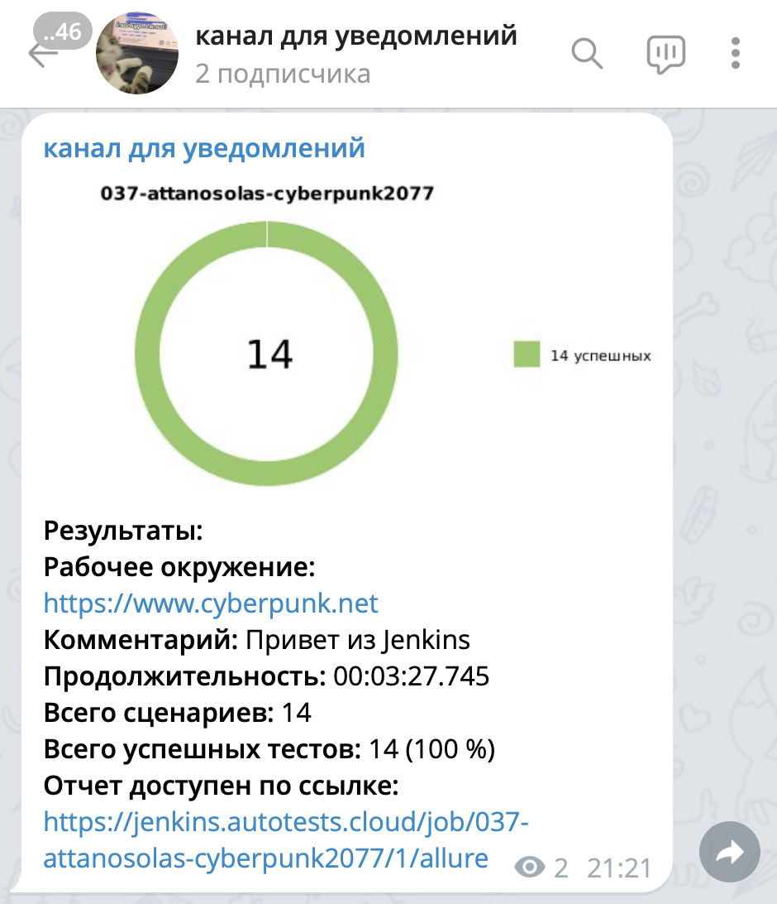
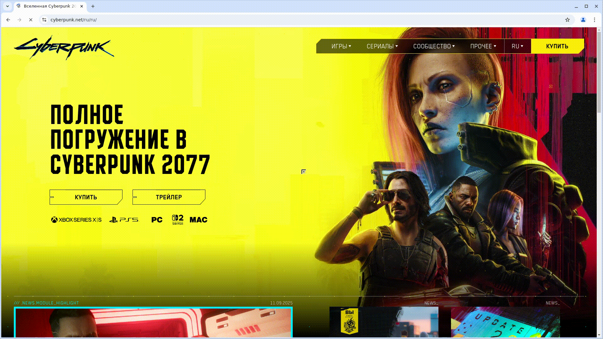

# Демопроект по автоматизации тестирования сайта Cyberpunk 2077
## :page_with_curl: Содержание:
- [Стек технологий](#dvd-стек-технологий)
- [Реализованные проверки](#-mag-реализованные-проверки)
- [Запуск автотестов](#crystal_ball-запуск-автотестов)
- [Сборка Jenkins](#oncoming_automobile-сборка-jenkins)
- [Отчет Allure](#bar_chart-отчет-allure)
- [Уведомление в Telegram](#bell-уведомление-в-telegram)
- [Видео примера запуска тестов в Selenoid](#movie_camera-видео-примера-запуска-тестов-в-selenoid)
---
## :dvd: Стек технологий
<p align="center">


</p>

---
## :mag: Реализованные проверки
- Проверка компонентов на главной странице сайта Cyberpunk 2077:
  - Текст "Полное погружение в Cyberpunk 2077" и кнопки "Купить" и "Трейлер"
  - Разделы меню
  - Наполнение разделов в меню
<p align="center">

</p>

---
## :crystal_ball: Запуск автотестов
Локальный запуск:
```bash
./gradlew clean ${TAG}
```
Запуск на удаленном браузере:
```bash
./gradlew clean
${TAG}
-Dremote=${SELENOID_URL}
-Dbrowser=${BROWSER}
-DbrowserVersion=${BROWSER_VERSION}
-DbrowserResolution=${BROWSER_RESOLUTION}
```
где параметры:
- `${TAG}` - какой табор тестов будет запущен
  - test - все тесты проекта
  - regress - все тесты проекта
  - smoke - самые критичные кейсы
- `${SELENOID_URL}` - урл селенойда
- `${BROWSER}` и `${BROWSER_VERSION}` - на каком браузере и какой версии запускать
  - chrome
    - 127.0
    - 128.0
  - firefox
    - 124.0
    - 125.0
- `${BROWSER_RESOLUTION}` - разрешение браузера
  - 1920x1080
  - 1366x768
  - 2560x1440

---
## :oncoming_automobile: Сборка Jenkins
Ссылка: [037-attanosolas-cyberpunk2077](https://jenkins.autotests.cloud/job/037-attanosolas-cyberpunk2077/)
<p align="center">

</p>

---
## :bar_chart: Отчет Allure
Главная страница отчета
<p align="center">

</p>
Пример теста в отчете
<p align="center">

</p>

---
## :bell: Уведомление в Telegram
<p align="center">

</p>

---
## :movie_camera: Видео примера запуска тестов в Selenoid
К каждому тесту в отчете прилагается видео прогона
<p align="center">
  
</p>
