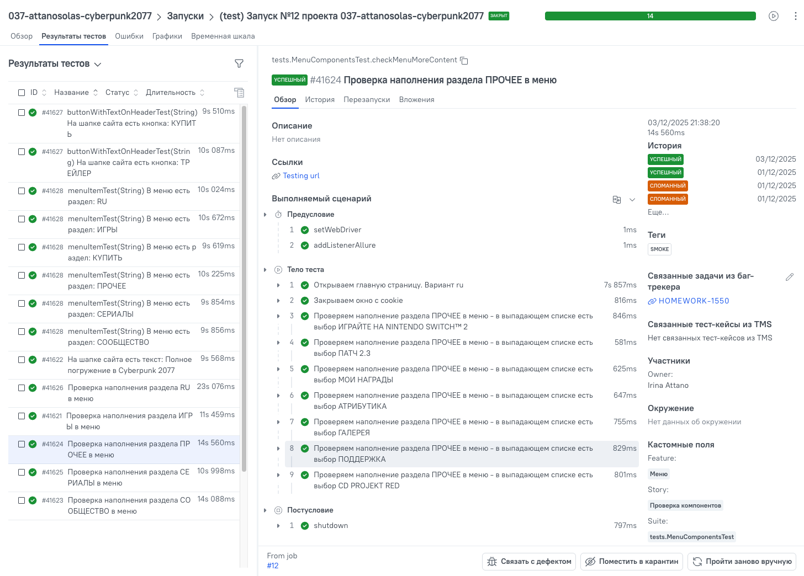
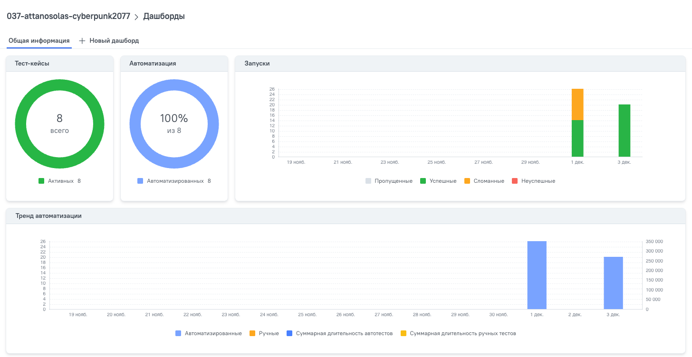
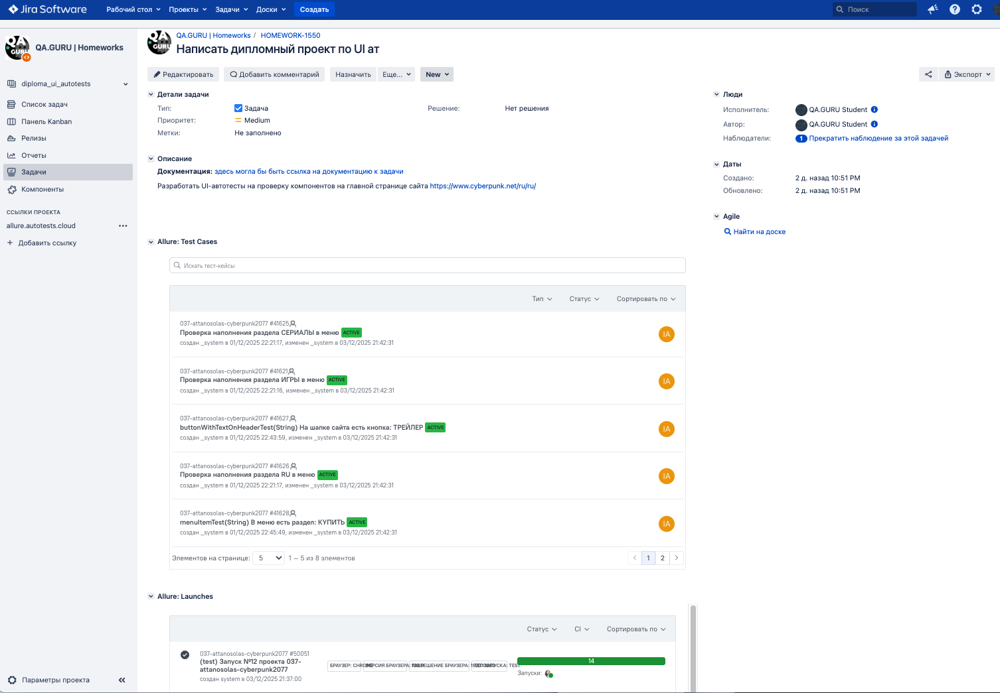

# Демопроект по автоматизации тестирования сайта Cyberpunk 2077
<p align="center">
<a href="https://www.cyberpunk.net/ru/ru/">
</p>

## :page_with_curl: Содержание:
- [Стек технологий](#dvd-стек-технологий)
- [Реализованные проверки](#mag-реализованные-проверки)
- [Запуск автотестов](#crystal_ball-запуск-автотестов)
- [Сборка Jenkins](#oncoming_automobile-сборка-jenkins--037-attanosolas-cyberpunk2077)
- [Отчет Allure](#bar_chart-отчет-allure)
- [TMS ТестОпс](#blue_book-tms-тестопс)
- [Задача в Jira](#information_source-задача-в-jira-homework-1550)
- [Уведомление в Telegram](#bell-уведомление-в-telegram)
- [Видео примера запуска тестов в Selenoid](#movie_camera-видео-примера-запуска-тестов-в-selenoid)
---
## :dvd: Стек технологий
<p align="center">
<a href="https://github.com/">
<a href="https://www.jetbrains.com/idea/">
<a href="https://www.java.com/">
<a href="https://gradle.org/">
<a href="https://junit.org/junit5/">
<a href="https://selenide.org/">
<a href="https://www.jenkins.io/"><
<a href="https://aerokube.com/selenoid/">
  <a href="https://aerokube.com/selenoid/latest/">
<a href="https://allurereport.org/">
<a href="https://web.telegram.org/">
<a href="https://qameta.io">
<a href="https://www.atlassian.com/software/jira">
</p>

---
## :mag: Реализованные проверки
- Проверка компонентов на главной странице сайта Cyberpunk 2077:
  - Текст "Полное погружение в Cyberpunk 2077" и кнопки "Купить" и "Трейлер"
  - Разделы меню
  - Наполнение разделов в меню
<p align="center">

</p>

---
## :crystal_ball: Запуск автотестов
**Локальный запуск:**
```bash
./gradlew clean ${TAG} -Denv=local
```
**Запуск на удаленном браузере:**
```bash
./gradlew clean ${TAG} -Denv=remote -DremoteUrl=${SELENOID_URL} -Dbrowser=${BROWSER} -DbrowserVersion=${BROWSER_VERSION} -DbrowserResolution=${BROWSER_RESOLUTION}
```
где параметры:
- `${TAG}` - какой табор тестов будет запущен
  - test - все тесты проекта (ранее, был тег regress, но он был навешен на все тесты, поэтому было принято решение убрать данный тег)
  - smoke - самые критичные кейсы
- `${SELENOID_URL}` - урл селенойда с логином и паролем
- `${BROWSER}` и `${BROWSER_VERSION}` - на каком браузере и какой версии запускать
  - chrome
    - 127.0
    - 128.0
  - firefox
    - 124.0
    - 125.0
- `${BROWSER_RESOLUTION}` - разрешение браузера
  - 1920x1080
  - 1366x768
  - 2560x1440

**Сгенерировать отчет:**
```bash
allure serve build/allure-results
```

---
## :oncoming_automobile: [Сборка Jenkins '037-attanosolas-cyberpunk2077'](https://jenkins.autotests.cloud/job/037-attanosolas-cyberpunk2077/)
<p align="center">

</p>

---
## :bar_chart: [Отчет Allure](https://jenkins.autotests.cloud/job/037-attanosolas-cyberpunk2077/1/allure/)
Главная страница отчета
<p align="center">

</p>
Пример теста в отчете
<p align="center">

</p>

---
## :blue_book: [TMS ТестОпс](https://allure.autotests.cloud/project/5026/test-cases?treeId=0)
Тест-кейс в запуске
<p align="center">

</p>
Общий дашборд проекта
<p align="center">

</p>

---
## :information_source: [Задача в Jira HOMEWORK-1550](https://jira.autotests.cloud/browse/HOMEWORK-1550)
<p align="center">

</p>

---
## :bell: Уведомление в Telegram
<p align="center">

</p>

---
## :movie_camera: Видео примера запуска тестов в Selenoid
К каждому тесту в отчете прилагается видео прогона
<p align="center">

</p>
